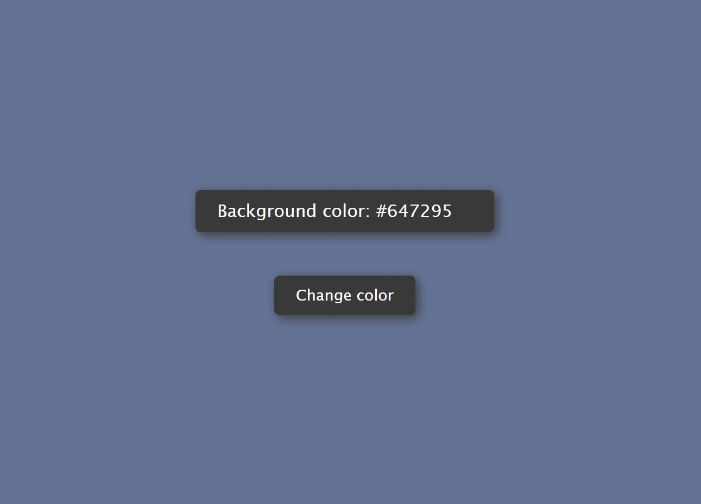

# Random bg color

## Description

An application for random color gyneration, from an array of colors. Implemented in HTML, CSS and JavaScript.

## Technologies that have been used

- HTML5
- CSS3
- JAVASCRIPT (ES6+)
- GIT

## Instructions for working with the project

1. Cloning a repository. You need to write `git clone https://github.com/boikoua/js_random-bg-color` in terminal.

## View project

> Link to the project
> [DEMO LINK](https://boikoua.github.io/js_random-bg-color/).

## Preview

